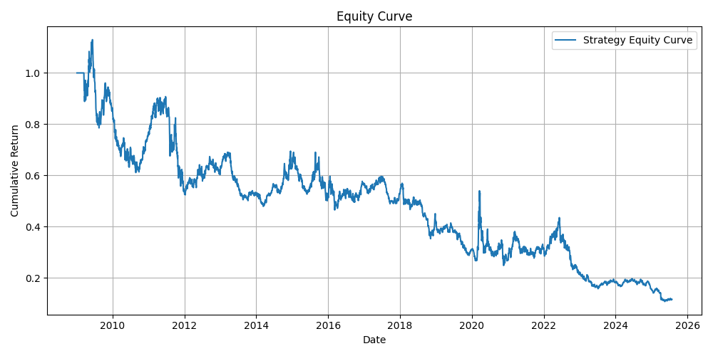

# 📈 Vectorized Backtesting Framework with SMA Crossover Strategy

This project implements a **lightweight, vectorized backtesting engine** in Python to evaluate trading strategies on historical market data. As a demonstration, I apply a basic **SMA (Simple Moving Average) crossover strategy** to the XLE ETF — a proxy for the U.S. energy sector.

---

## 🚀 Project Highlights

- 🔁 **Modular backtesting engine** built from scratch using `NumPy` and `Pandas`
- ⚙️ Strategy logic: SMA 20/50 crossover
- 📊 Evaluates performance using key metrics: **Sharpe Ratio**, **Max Drawdown**, and cumulative return
- 🖼️ Automatically generates and saves equity curve plots
- 📦 Clean project structure with reusable components and data loading logic

---

## 🧠 Strategy Evaluation

> **Asset:** XLE (Energy Select Sector SPDR Fund)  
> **Period:** 2009–2025  
> **Strategy:** Go long when 20-day SMA > 50-day SMA

### 📊 Key Metrics

| Metric         | Value         |
|----------------|---------------|
| Sharpe Ratio   | –0.31         |
| Max Drawdown   | –89.45%       |

### 🧾 Interpretation

The SMA 20/50 crossover strategy on XLE resulted in significant drawdowns and negative risk-adjusted returns. The strategy repeatedly entered false breakouts during volatile periods, leading to capital erosion.

### 📉 Equity Curve

---

## 🔍 Key Learnings

- Not all strategies generalize across asset classes.
- SMA crossover may not be suitable for mean-reverting or cyclical assets like energy.
- Backtesting failures offer **valuable insight** into asset behavior and strategy robustness.

---

## 🔬 Next Steps

I’m extending this project in two directions:

### ✅ 1. **Volatility-Aware SMA Strategy**
Add an **ATR-based volatility filter** to avoid trades during unstable regimes.

### ✅ 2. **Asset Comparison**
Apply the same strategy across:
- **SPY** (broad U.S. equities)
- **QQQ** (NASDAQ 100)
- **BTC-USD** (crypto)

The goal is to evaluate **strategy robustness and generalizability** across asset classes.

---

## 📁 Project Structure