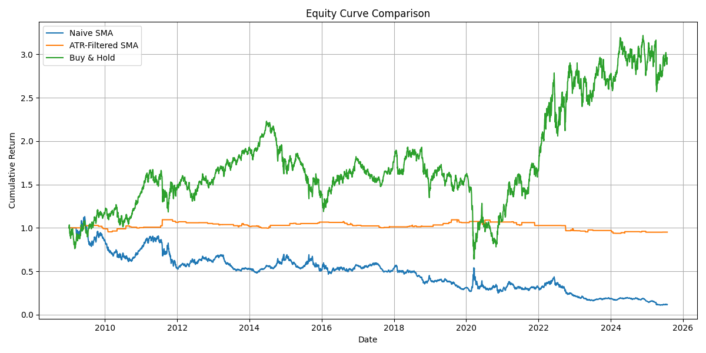

# 📈 Vectorized Backtesting Framework with SMA Crossover Strategy

This project implements a **lightweight, vectorized backtesting engine** in Python to evaluate trading strategies on historical market data. It demonstrates how a basic SMA crossover strategy can be extended with volatility filters to manage risk and improve robustness. As a demonstration, I applied this framework to the XLE ETF — a proxy for the U.S. energy sector: A naive SMA strategy, an ATR based volatility aware version, buy and hold benchmark.

---

## 🚀 Project Highlights

- 🔁 **Modular backtesting engine** built from scratch using `NumPy` and `Pandas`.
- ⚙️ Strategies: Basic SMA crossover and ATR-filtered SMA crossover.
- 📊 Evaluates performance using key metrics: **Sharpe Ratio**, **Sortino Ratio**, **Calmar Ratio**, **Max Drawdown**, and trade stats.
- 🖼️ Automatically generates and saves equity curve comparison plots.
- 📦 Clean project structure with reusable components and data loading logic.

---

## 🧠 Strategy Evaluation

> **Asset:** XLE (Energy Select Sector SPDR Fund)  
> **Period:** 2009–2025  
> **Strategies:**  
> - **Naive SMA**: Go long when 20-day SMA > 50-day SMA  
> - **Volatility-Aware SMA**: Same as above, but only when 14-day ATR is below its 100-day average  

### 📊 Key Metrics

| Metric              | Naive SMA     | ATR-Filtered SMA |
|---------------------|---------------|------------------|
| Sharpe Ratio        | –0.33         | –0.05            |
| Sortino Ratio       | –0.45         | –0.02            |
| Calmar Ratio        | –0.98         | –0.34            |
| Max Drawdown        | –90.41%       | –14.39%          |
| Total Trades        | 98            | 157              |
| Win Rate            | 28.6%         | 34.4%            |
| Avg Profit (Winners)| 9.48%         | 4.02%            |
| Avg Loss (Losers)   | –5.84%        | –5.00%           |

### 🧾 Interpretation

The **volatility-aware SMA strategy** demonstrates vastly improved drawdown control, albeit at the cost of muted returns. It filters out unstable market conditions and prevents premature trades, showcasing how a simple filter can boost risk-adjusted performance.

### 📉 Equity Curve Comparison

---

## 🔍 Key Takeaways

- The **naive SMA strategy** performed poorly on XLE, with deep drawdowns and a negative Sharpe.
- **Adding a volatility filter (ATR)** significantly improved the equity curve by avoiding whipsaws.
- Not all strategies are equally effective across all assets — energy, in particular, may require regime filters.
- This experiment showcases the **importance of tailoring strategy logic to asset characteristics**.

---

## 🔬 Next Steps

I’m extending this project in two directions:

### ✅ 1. Strategy Generalization

Apply both strategies to:
- **SPY** (S&P 500)
- **QQQ** (NASDAQ 100)
- **BTC-USD** (Bitcoin)

This will help evaluate performance **across asset classes and regimes**.

### ✅ 2. Strategy Enhancement

Experiment with:
- **ATR thresholds** and parameter tuning
- **Stop losses and position sizing**
- **Signal smoothing** or combined indicators (e.g., SMA + RSI)

---